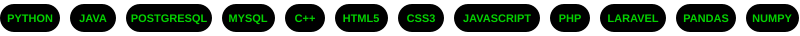

  

  <!-- Animated Header / Typing SVG -->
  <h1>Muhammad Narendra Hawari</h1>

  

   

  <!-- Profile Metrics & Status Badges -->
  

    
    
    
    
  

  <!-- Quick Social Connect Hub -->
  

    
    
    
  

  <i>Bridging Data Science, Machine Learning, and Large Language Models to solve real-world problems and optimize operational systems.</i>

---

## About Me

I am an **Informatics and Data Science** undergraduate at **Universitas Ahmad Dahlan (UAD)**, with hands-on experience in **Machine Learning, Data Mining, Mobile Development, and Generative AI**.

I am passionate about harnessing data insights and artificial intelligence to solve practical, real-world problems — particularly within **operational optimization, business digitalization, and intelligent transportation systems**. Through solid analytical thinking and algorithmic problem-solving, I strive to build sustainable, high-impact technological solutions.

- **Academic Foundation:** S1 Informatika @ Universitas Ahmad Dahlan (Sep 2022 – Jun 2026)
- **Specialization:** Data Mining, Machine Learning, K-Means Clustering, and Large Language Models (LLMs)
- **Teaching Experience:** 6-term Laboratory Assistant at Informatika UAD (Machine Learning, Data Mining, Mobile Android, Statistics, Algorithms, Fundamentals of Programming)
- **Certified Achievement:** Awarded *The Most Active Student* at MSIB Kampus Merdeka Batch 7 — Celerates (Data Science Basics, Score: **93.91 / 100.00**)
- **Applied Interest:** Operational Efficiency, Intelligent Transportation & Mobility, and Business Process Digitalization
- **Ask Me About:** Python, Machine Learning Pipelines, K-Means & LLM Integration, Dataset Preprocessing, or Android Development

 

<!-- Real Projects & Research Highlights from CV -->

  
<b>Featured Research & Key Projects</b>

   

  - **Undergraduate Thesis: K-Means & LLM-Powered Chatbot for Business Owners**
    * *Pengembangan Chatbot K-Means Large Language Models untuk Owner pada Usaha Persewaan Hashsky Motor Yogyakarta*
    * Designed an intelligent chatbot combining K-Means customer/rental clustering with Large Language Models (LLMs) to provide automated operational insights and data-driven decision support for motorcycle rental businesses.

  - **SmartRental Invoice AI — LKTI UMS Spark 2026**
    * *An LLM-Based Financial Document Processing System for Digitalizing Motorcycle Rental Businesses*
    * Proposed and developed an automated document processing framework utilizing LLMs to extract, parse, and structure rental invoices and financial paperwork for small-to-medium rental enterprises.

  - **Customer Segmentation with K-Means & Gemini LLM — Celerates MSIB 7**
    * *Integrating K-Means and Gemini LLM for Coffee Shop Customer Segmentation*
    * Implemented unsupervised machine learning (K-Means) on transactional data and integrated Google Gemini LLM to automatically generate descriptive persona profiles and personalized marketing action plans.

  - **Android Mobile Application Development — UAD Informatics Laboratory**
    * Mentored students and built Android mobile applications focusing on native architecture, UI implementation, and client-side data handling.

  
<b>Work & Teaching Experience</b>

   

  - **Laboratory Teaching Assistant** — *Laboratorium Informatika Universitas Ahmad Dahlan*
    - **Machine Learning** *(Sep 2025 – Jan 2026)*: Dataset preparation, model building, hyperparameter tuning, testing, and evaluation.
    - **Data Mining** *(Sep 2025 – Jan 2026)*: Data preprocessing, feature engineering, and predictive ML algorithm selection.
    - **Pemrograman Mobile** *(Sep 2025 – Jan 2026)*: Android native application development and lab mentoring.
    - **Statistika Informatika** *(Sep 2024 – Jan 2025)*: Probability theory, statistical testing, and computational statistics.
    - **Algoritma dan Pemrograman** *(Mar 2024 – Aug 2024)*: Logic design, data structures, and algorithmic implementation.
    - **Dasar Pemrograman** *(Sep 2023 – Feb 2024)*: Programming logic, syntax, and foundational programming.
  - **Student Employment** — *Magister Manajemen Pendidikan FKIP UAD (Sep 2024 – Sep 2025)*
    - Managed social media publication, drafted press releases, and compiled meeting reports & documentation.
  - **Data Science Studi Independent** — *Celerates / MSIB Batch 7 Kampus Merdeka (Sep 2024 – Dec 2024)*
    - Finished with distinction (93.91/100), honored as *The Most Active Student*, and completed training in Data Processing & Generative AI.

  
<b>Leadership & Organizational Impact</b>

   

  - **Ketua Komisi Pemilihan Umum (KPUM)** — *Informatika UAD (Nov 2023 – Feb 2024)*
    - Led and presided over the student election for the Informatics Student Association, organized candidate debates, and maintained institutional governance.
  - **Ketua Kelompok KKN Reguler 145** — *Girikerto, Turi, Sleman, DIY (May 2025 – Sep 2025)*
    - Spearheaded community empowerment programs, coordinated with village leadership, and organized developmental initiatives at Bumi Perkemahan Lembah Merapi & partner schools.
  - **Fasilitator & Pemegang Hak Cipta (HKI)** — *PkM Dakwah Digital (2025)*
    - Design facilitator for community workshops using Canva; registered official Intellectual Property (HKI) for educational video production.

---

## Tech Stack & Tooling

  

 

### Languages

  
  
  
  
  
  
  
  
  
  
  
  

### Data Science & Machine Learning

  
  
  
  
  
  
  

### Environments & Developer Tools

  
  
  
  
  
  
  
  

---

  

    <b>Let's collaborate on data-driven intelligence and impactful engineering solutions! 🚀</b>
  

  

    
  <i>Muhammad Narendra Hawari • Portfolio & GitHub Hub</i>

